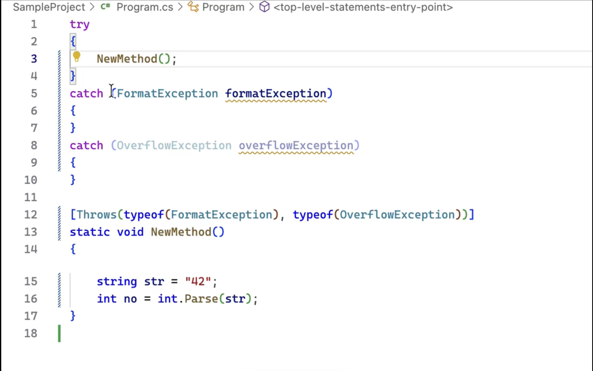

# Checked Exceptions for C#

**Take control of exception flow — enforce explicit handling or declaration in C#**

[](…)   [](https://www.nuget.org/packages/Sundstrom.CheckedExceptions/) 

[❓ FAQ](#user-content--frequently-asked-questions-faq) • [🧪 Sample project](https://github.com/marinasundstrom/CheckedExceptions/blob/main/SampleProject/Program.cs) • [📚 Documentation](docs) • [📝 Change Log](CHANGELOG.md)

---

## Demo

_Click the image to watch the [video](https://www.youtube.com/watch?v=ldJjMrqB8X4) om YouTube._

<a href="https://www.youtube.com/watch?v=ldJjMrqB8X4"></a>

There are other videos in [this playlist](https://www.youtube.com/playlist?list=PLLBU--06ftFpmZWhQExVDXcefWol1i0zq).

---

## 🚀 What It Does

CheckedExceptions is a Roslyn analyzer that makes exception handling **explicit** and reveals how exceptions propagate through your code.

If a method might throw an exception, the caller must either:

* 🧯 Handle it (with `try/catch`), or
* 📣 Declare it (with `[Throws(typeof(...))]`)

✅ Inspired by Java’s checked exceptions<br />
⚙️ Fully opt-in<br />
💡 Analyzer warnings by default — can be elevated to errors<br />
📄 Supports .NET and third-party libraries via XML documentation<br />
🛠 Includes code fixes to help you quickly handle or declare exceptions<br />

---

## ✅ Quick Example

```csharp
public class Sample
{
    public void Execute()
    {
        // ⚠️ THROW001: Unhandled exception type 'InvalidOperationException'
        Perform();
    }

    [Throws(typeof(InvalidOperationException))]
    public void Perform()
    {
        throw new InvalidOperationException("Oops!");
    }
}
```

✔️ Fix it by **handling**:

```csharp
public void Execute()
{
    try { Perform(); }
    catch (InvalidOperationException) { /* handle */ }
}
```

Or by **declaring**:

```csharp
[Throws(typeof(InvalidOperationException))]
public void Execute()
{
    Perform();
}
```

---

## 🧠 Why Use It?

- Avoid silent exception propagation
- Document intent with `[Throws]` instead of comments
- Enforce better error design across your codebase
- Works with unannotated .NET methods via XML docs
- Plays nice with nullable annotations
- Avoid confusing [Throws] with `<exception>` — enforce contracts, not just documentation

---

## 📦 Installation

```bash
dotnet add package Sundstrom.CheckedExceptions
```

And define `ThrowsAttribute` in your project:

```csharp
[AttributeUsage(AttributeTargets.Method | AttributeTargets.Constructor | AttributeTargets.Delegate, AllowMultiple = true)]
public class ThrowsAttribute : Attribute
{
    public List<Type> ExceptionTypes { get; } = new();
    public ThrowsAttribute(Type exceptionType, params Type[] others) { … }
}
```

Find the full definition [here](https://github.com/marinasundstrom/CheckedExceptions/blob/main/CheckedExceptions.Attribute/ThrowsAttribute.cs).

---

## ⚙️ Configuration

### .editorconfig

```ini
dotnet_diagnostic.THROW001.severity = warning
dotnet_diagnostic.THROW003.severity = warning
```

### `.csproj`

```xml
<PropertyGroup>
  <WarningsAsErrors>nullable,THROW001</WarningsAsErrors>
</PropertyGroup>
```

### JSON Settings

Add `CheckedExceptions.settings.json`:

```json
{
  "ignoredExceptions": [ "System.ArgumentNullException" ],
  "informationalExceptions": {
    "System.IO.IOException": "Propagation",
    "System.TimeoutException": "Always"
  }
}
```

Register in `.csproj`:

```xml
<ItemGroup>
  <AdditionalFiles Include="CheckedExceptions.settings.json" />
</ItemGroup>
```

---

## 🔍 Diagnostics

| ID         | Message                                                   |
| ---------- | --------------------------------------------------------- |
| `THROW001` | ❗ Unhandled exception: must be caught or declared                         |
| `THROW003` | 🚫 Avoid declaring general `Exception` in `[Throws]`                       |
| `THROW004` | 🚫 Avoid throwing exception base type `Exception`                          |
| `THROW005` | 🔁 Duplicate declarations of the same exception type in `[Throws]`         |
| `THROW006` | 🧬 Declared on override, missing from base                                 |
| `THROW007` | 🧬 Declared on base, missing from override                                 |
| `THROW008` | 📦 Exception already handled by declaration of super type in `[Throws]`    |
| `THROW009` | 🧹 Redundant catch clause                                                  |

## 🛠 Code Fixes

The analyzer offers the following automated code fixes:

- ✅ **Add `[Throws]` declaration** – Adds a `[Throws(typeof(...))]` attribute to declare the exception.
- 🧯 **Surround with try/catch** – Wraps the statement in a `try` block with a generated `catch`.
- 🧯 **Add catch to existing try block** – Appends a new `catch` clause to a nearby `try` block.
- 🧹 **Remove redundant catch clause** – Removes the catch clause for an undeclared exception type.
- 🪛 **Suppress warning** – Adds `#pragma warning disable` or `[SuppressMessage]`.

---

## ✨ Advanced Features

- Supports lambdas, local functions, accessors, events
- Analyzes exception inheritance trees
- Merges `[Throws]` with `<exception>` from XML docs
- Handles nullability context (`#nullable enable`)  
- Understands standard library exceptions (e.g. `Console.WriteLine` → `IOException`)

---

## ❓ Frequently Asked Questions (FAQ)

### ❓ How is this different from Java's checked exceptions?

**Answer:**

Java's checked exceptions are **mandatory** — the compiler enforces them, and every method must declare or handle them. While this promotes visibility, it also leads to friction, boilerplate, and workarounds like `throws Exception`.

This analyzer takes a **modern, flexible approach**:

* ⚠️ **Warnings by default**, not errors — you’re in control.
* ✍️ **Opt-in declaration** using `[Throws]` — only where it matters.
* 🛠️ **Code fixes and suppression** make adoption practical.
* 🔄 **Gradual adoption** — use it for new code, leave legacy code untouched.
* 🎯 **Focused on intention**, not obligation — you declare what callers need to know, not what `int.Parse` might throw.

> ✅ Summary:
> This is *exception design with intent*, not enforcement by force. It improves exception hygiene without the rigidity of Java’s model.

### ❓ Can I use `<exception>` XML documentation tags instead of the `[Throws]` attribute?

**Answer:**

No — for your own code, `<exception>` tags are **not treated as semantic declarations** by the analyzer. While they are useful for documentation and IntelliSense, they are not part of the C# language’s type system and cannot be reliably analyzed or enforced.

Instead, we encourage and require the use of the `[Throws]` attribute for declaring exceptions in a way that is:

- Explicit and machine-readable  
- Suitable for static analysis and enforcement  
- Integrated with code fixes and tooling support

#### 🧩 Interoperability with external libraries

When analyzing external APIs (e.g., referenced .NET assemblies), we **do** recognize `<exception>` tags from their XML documentation — but only for **interop purposes**. That is:

- We treat documented exceptions from public APIs as "declared" when `[Throws]` is not available.
- This helps maintain compatibility without requiring upstream changes.

> ⚠️ Summary:  
> `<exception>` tags are respected for **interop**, but they are **not a replacement** for `[Throws]` in code you control.

### ❓ What about .NET Standard 2.0 support?

**Answer:**

The analyzer offers **limited support** for projects targeting .NET Standard 2.0. You’ll still get accurate diagnostics for your own code, as well as third-party libraries. However, members defined in the .NET Standard framework may not indicate which exceptions they throw.

This is due to a **technical limitation**: the XML documentation files for .NET Standard assemblies are often incomplete or malformed, making it impossible to extract reliable exception information.

✅ **Recommendation:** Target a modern .NET SDK (e.g., .NET 6 or later) to get full analyzer support, including framework exception annotations.

### ❓ What about LINQ support?

**Answer:**

There’s no special support for LINQ at the moment. Since LINQ queries are typically deferred and represented as expression trees or objects, it’s difficult to determine where and when exceptions will actually be thrown.

We may explore better support in the future, but for now, these cases are considered out of scope.

---

## 🤝 Contributing

1. Fork  
2. Create feature branch  
3. Push PR with tests & documentation  
4. ❤️

---

## 📜 License

[MIT](LICENSE)
